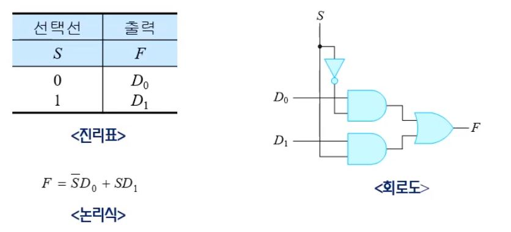
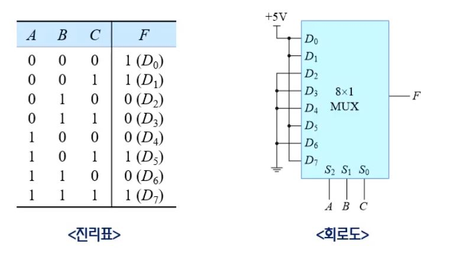
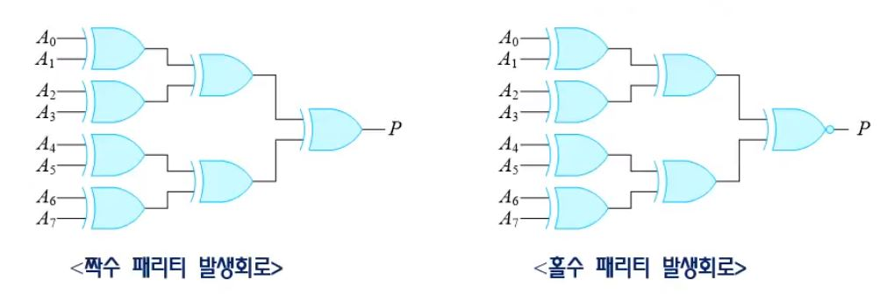

# 조합논리회로2

##  목차

5. [멀티플렉서](#멀티플렉서)
6. [디멀티플렉서](#디멀티플렉서)
7. [코드 변환기](#코드 변환기)
8. 패리티 발생기/검출기

### 멀티플렉서

* <mark>여러 개의 입력선들 중에서 하나를 선택 </mark>하여 출력선에 연결하는 조합 논리회로이다.
* 선택 선들의 값에 따라 특별한 입력선이 선택된다.
* 선택된 입력선의 2진 정보를 출력선에 넘겨주기 때문에 `데이터선택기`라고도 한다.

인코더와 역할이 비슷함

 

 

#### 2 $$\times$$ 1 멀티플렉서

* $$2^1$$개의 입력 중 하나를 선택선 S에 입력된 값에 따라서 출력으로 보내줌

#### 4 $$\times$$ 1 멀티플렉서

#### 8 $$\times$$ 1 멀티플렉서

#### 4 $$\times$$ 1 멀티플렉서를 이용한 16 $$\times$$1 멀티플렉서

#### 멀티플렉서를 이용한 조합회로 구현

* $$F(A,B,C) = \sum m(0, 1, 5, 7)$$을 8$$\times$$1 멀티플렉서로 구현하는 경우

  * 3개의 선택선을 입력 $$A,B,C$$로 사용

   

* $$F(A,B,C) = \sum m(0, 1, 5, 7)$$을 4$$\times$$1 멀티플렉서로 구현하는 경우

  * $$A,\, B$$는 선택선으로 $$C$$는 $$D_0,D_1,D_2,D_3$$을 조합하여 사용

   

### 디멀티플렉서

* 1개의 `enable`입력을 가지고 있는 디코더는 디멀티플렉서로서의 기능을 수행
* 정보를 한 선으로 받아서 $$2^n$$개의 가능한 출력 선들 중 하나를 선택하여, 받은 정보를 전송하는 회로.
* $$n$$개의 선택선 들을 이용하여 출력을 제어함.

 

### 코드 변환기

#### 2진코드 - 그레이 코드 변환

#### 그레이 코드 변환 - 2진코드 

#### BCD코드- 3초과 코드

* 10개의 숫자 $$1010_(2)$$ 이후의 코드는  BCD에 존재하지 않으므로 무관항 처리함.

### 패리티 발생기 / 검출기

#### 패리티 발생기(짝수)

* 전송할 데이터에서 값이 1인 비트의 수를 확인하고, `짝수` 라면 0을 발생시키고, `홀수` 라면 1을 발생시킨다.

#### 패리티 검출기 (짝수)

* 전송받은 데이터에서 값이 1인 비트의 수를 확인하여 만약 그 수가 `홀수` 개라면 오류 발생을 알리기 위해 1을 발생시킨다.

$$P_{even} = A_0 \oplus A_1 \oplus \cdots \oplus A_7$$ 

$$P_{odd} = \overline{A_0 \oplus A_1 \oplus \cdots \oplus A_7}$$ 

