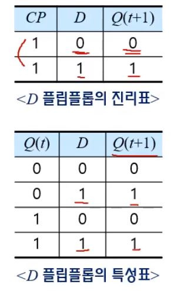
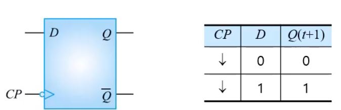
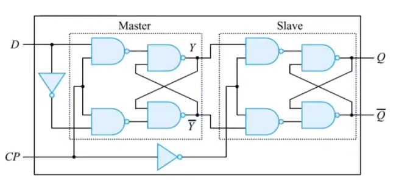
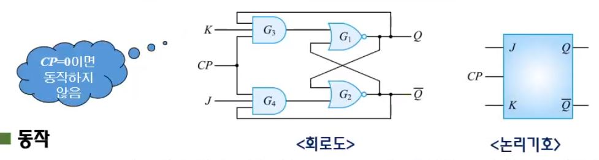
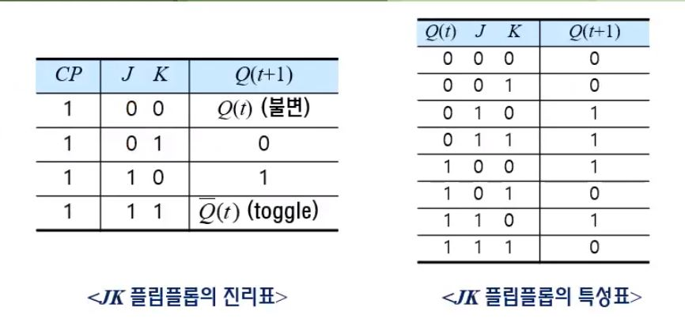
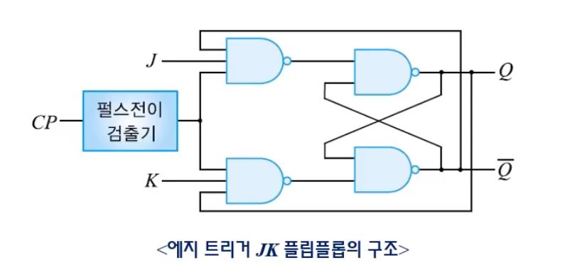
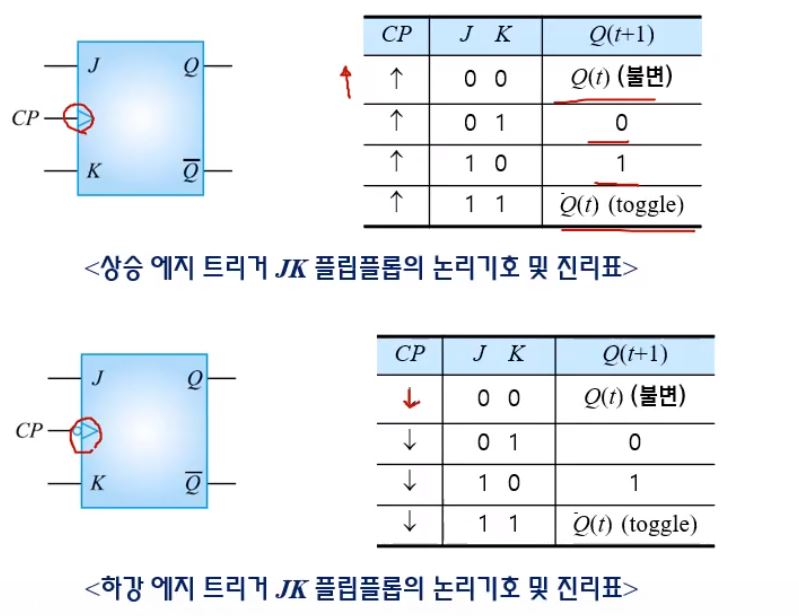
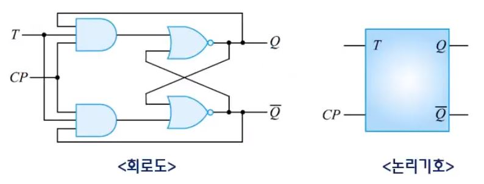
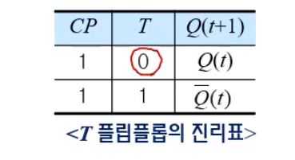
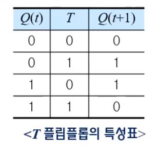

# 플립플롭

##  목차

* D 플립플롭
* JK 플립플롭
* T플립플롭
* 비동기 입력
* 플립플롭의 동작 특성
* 멀티 바이브레이터 (생략)

## 개요

### 조합 논리회로 / 순서 논리 회로

* **조합 논리 회로** : 출력이 현재의 입력에 의해서만 결정되는 논리회로

* **순서 논리회로** : 현재의 입력과 이전의 상태에 의해서 출력이 결정되는 논리회로

  * 동기 순서회로 : 상태는 클럭펄스가 들어오는 시점에서 상태가 변화하는 회로 (플립플롭 사용)
  * 비동기 순서회로 : 시간에 관계없이 입력이 변화하는 순서에 따라 동작하는 회로 (래치 사용)
     

  > **래치** : 비동기식 기억회로, 입력이 바뀌면 즉시 출력에 반영 
  >
  > (잡음이 있음)
  >
  > 
  >
  > **플립플롭**: 동기식 기억회로, 입력이 바뀌어도 출력에 반응되지 않으며, 특정 조건 (트리거 조건)에서 결과로 반영 
  >
  > (클럭을 사용, 래치 응용 방식, 클럭이 상승 또는 하강할 때만 결정되어 나타남.)
  >
  > 
  >
  > `2개의 안정된 상태 (0 or 1) 중 하나의 값을 가지는 1bit 기억소자`
  >
  > **상태** 
  >
  > * current : $$Q(t)$$ or $$q$$
  > * next : $$Q(t+1)$$ or $$q*$$

  

## 기본적인 플립플롭

### D 플립플롭

#### 클록형 D 플립플롭

* SR 플립플롭에서 원하지 않는 상태를 제거하는 방법
* 클록형 D 플립플롭은 클록형 SR 플립플롭을 변형한 것
* 입력신호 D 가 CP에 동기되어 그대로 출력에 전달하는 특성을 가짐
* D 플립플롭은 Data를 전달하는 것, Delay 역할에서 유래됨

#### 에지 트리거 D 플립플롭

* 클록형 D 플립플롭의 클록펄스 입력에 펄스전이검출기를 추가하여 구성함
* 나머진 같고, CP가 0이고 D가 1일 때 Q(t+1)은 1임

#### 주종형 D 플립플롭

> **CP = 1** : 외부의 D 입력이 Master 플립플롭에 전달, Slave플립플롭은 CP=0이므로 동작 안함.
>
> **CP=0** : Slave의 플립플롭이 동작하여 Q=Y, Q=Y 이고, Master 플립플롭은 CP=0이므로 동작하지 않음.

### JK 플립플롭

#### 클록형 JK 플립플롭

* JK 플립플롭은 SR 플립플롭에서 S=1, R=1인 경우 출력이 불안정한 상태가 되는 문제점을 개선하여
  S=1, R=1에서도 동작하도록 개선한 회로
* JK 플립플롭의 J는 S(set)에, K는 R(reset)에 대응하는 입력
* J=1, K=1인 경우 JK 플립플롭의 출력은 이전 출력의 보수 상태로 변화
* JK 플립플롭은 플립플롭 중에서 가장 많이 사용되는 플립플롭임.

#### 에지 트리거 JK 플립플롭

* 클록형 JK 플립플롭의 클록펄스 입력에 펄스전이 검출기를 추가하여 구성

#### 주종형 JK 플립플롭

> **CP = 1** : 외부의 J 와 K 입력이 Master 플립플롭에 전달, Slave 플립플롭은 CP=0이므로 동작하지 않음
>
>
> **CP = 0** : Slave 플립플롭이 동작하여 Q=Y, Q=Y
> Master 플립플롭은 CP = 0이므로 동작하지 않음.

### T 플립플롭

#### 클록형 T 플립플롭

* JK 플립플롭의 J 와 K 입력을 묶어서 하나의 입력신호 T로 동작시키는 플립플롭
* JK 플립플롭의 동작에서 입력이 모두 0이거나 1인 경우만을 이용하는 플립플롭
* T 플립플롭의 입력 T=0이면, T 플립플롭은 J=0, K=1 JK 플립플롭과 같이 동작하므로 출력은 보수가 됨

