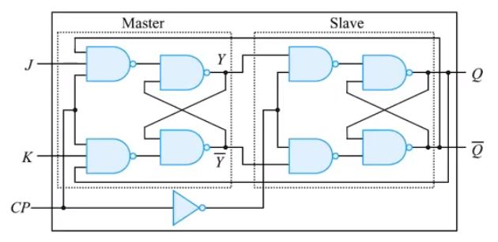

# 플립플롭2

##  목차

* D 플립플롭
* JK 플립플롭
* T플립플롭
* 비동기 입력
* 플립플롭의 동작 특성
* 멀티 바이브레이터 (생략)

## 기본적인 플립플롭

### D 플립플롭

#### 클록형 D 플립플롭

* SR 플립플롭에서 원하지 않는 상태를 제거하는 방법
* 클록형 D 플립플롭은 클록형 SR 플립플롭을 변형한 것
* 입력신호 D 가 CP에 동기되어 그대로 출력에 전달하는 특성을 가짐
* D 플립플롭은 Data를 전달하는 것, Delay 역할에서 유래됨

#### 에지 트리거 D 플립플롭

* 클록형 D 플립플롭의 클록펄스 입력에 펄스전이검출기를 추가하여 구성함
* 나머진 같고, CP가 0이고 D가 1일 때 Q(t+1)은 1임

#### 주종형 D 플립플롭

> **CP = 1** : 외부의 D 입력이 Master 플립플롭에 전달, Slave플립플롭은 CP=0이므로 동작 안함.
>
> **CP=0** : Slave의 플립플롭이 동작하여 Q=Y, Q=Y 이고, Master 플립플롭은 CP=0이므로 동작하지 않음.

### JK 플립플롭

#### 클록형 JK 플립플롭

* JK 플립플롭은 SR 플립플롭에서 S=1, R=1인 경우 출력이 불안정한 상태가 되는 문제점을 개선하여
  S=1, R=1에서도 동작하도록 개선한 회로
* JK 플립플롭의 J는 S(set)에, K는 R(reset)에 대응하는 입력
* J=1, K=1인 경우 JK 플립플롭의 출력은 이전 출력의 보수 상태로 변화
* JK 플립플롭은 플립플롭 중에서 가장 많이 사용되는 플립플롭임.

#### 에지 트리거 JK 플립플롭

* 클록형 JK 플립플롭의 클록펄스 입력에 펄스전이 검출기를 추가하여 구성

#### 주종형 JK 플립플롭

> **CP = 1** : 외부의 J 와 K 입력이 Master 플립플롭에 전달, Slave 플립플롭은 CP=0이므로 동작하지 않음
>
>
> **CP = 0** : Slave 플립플롭이 동작하여 Q=Y, Q=Y
> Master 플립플롭은 CP = 0이므로 동작하지 않음.

### T 플립플롭

#### 클록형 T 플립플롭

* JK 플립플롭의 J 와 K 입력을 묶어서 하나의 입력신호 T로 동작시키는 플립플롭
* JK 플립플롭의 동작에서 입력이 모두 0이거나 1인 경우만을 이용하는 플립플롭
* T 플립플롭의 입력 T=0이면, T 플립플롭은 J=0, K=1 JK 플립플롭과 같이 동작하므로 출력은 보수가 됨

#### 에지 트리거 T 플립플롭

* T 입력은 논리 1 상태로 고정하고 CP에 클록펄스를 트리거 입력으로 사용하기도 함.

  이때 T 플립플롭은 클록펄스가 들어올 떄마다 상태가 바뀌는 회로이다.

### 비동기 입력

* 대부분 플립플롭은 클록펄스에 의해서 플립플롭의 상태를 변화시킬 수 있는 동기 입력이 있고, 클록 펄스와 관계없이 비동기적으로 변화시킬 수 있는 비동기 입력인

  $$\bar{PR}$$과, $$\bar{CLR}$$이 있음.

